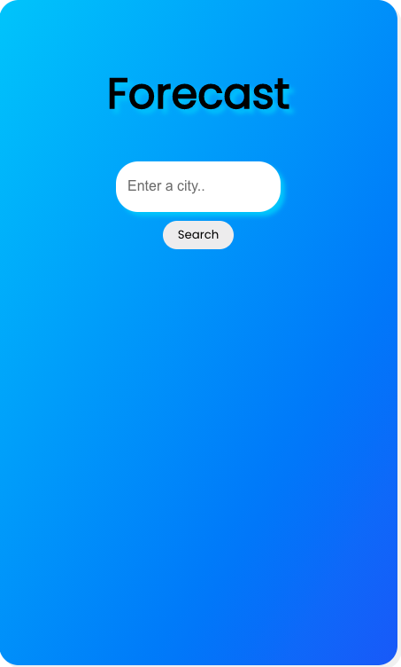
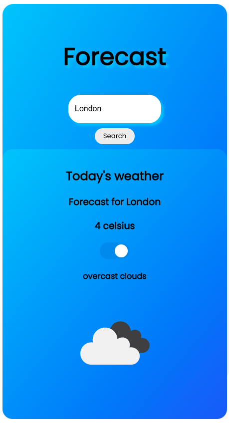

# React: Weather Forecasting app

##### January 2021

I built this weather app to practice passing state and props around in React. This app makes use of the OpenWeather API and has a mobile first design.

#### App
 

## To Start

Clone the repo as instructed below and install npm modules. Add .env file for local usage. You will need to sign up for a Current Weather Data API [here](https://openweathermap.org/api)

## Installation

1.  Clone the repo 
    `https://github.com/kumsw/weather-app.git`
2.  Download the required npm modules. 
    `npm i` 
3.  Add environment variables  
    `REACT_APP_API_KEY={YOUR OPEN WEATHER API CREDENTIALS}` 
4.  Open a terminal and start the the React app using the following command: ` npm run start` 

## Usage:

Enter location and see the weather. Temperature can be toggled to show temperature in farenheit or celsius.
